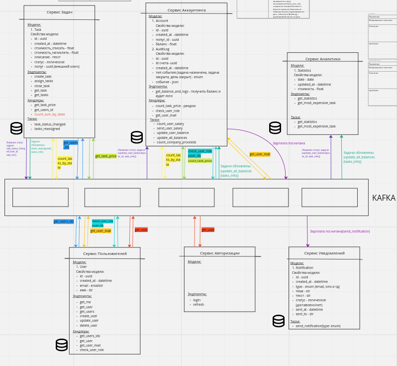
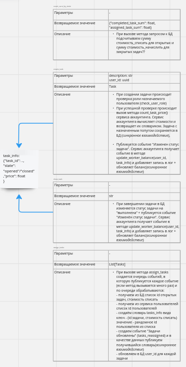
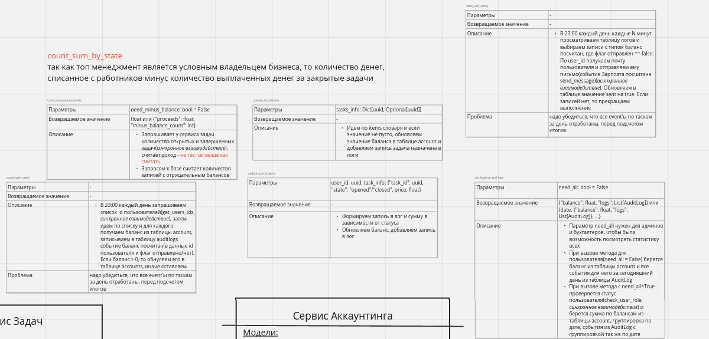
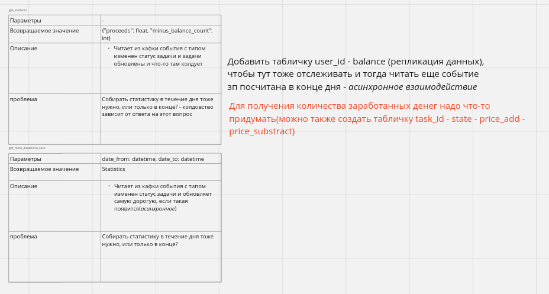
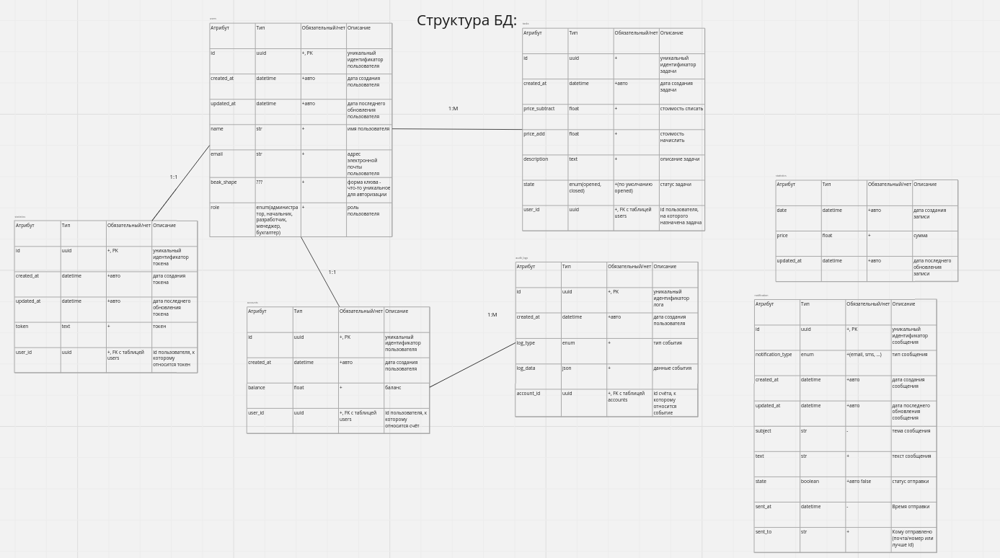

# Homework 0

## Задача: создать черновой проект системы

Полное решение: https://miro.com/app/board/uXjVMyvg4MU=/?share_link_id=462075964136

Выбрано 6 сервисов: Авторизация, пользователи, Задачи, Аккаунтинг, Аналитика, Уведомления

Взаимодействие через брокер сообщение Kafka

Общая схема:

Методы для задач:

Методы для аккаунтинга:

Методы для аналитики:

Структура БД:

