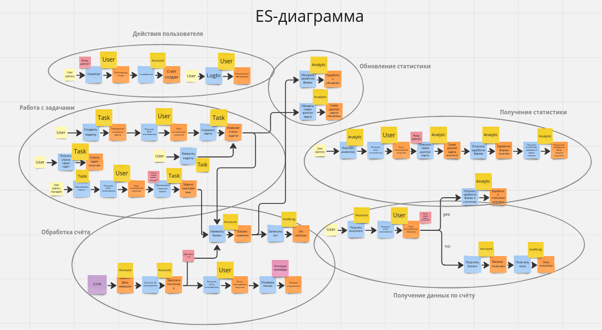
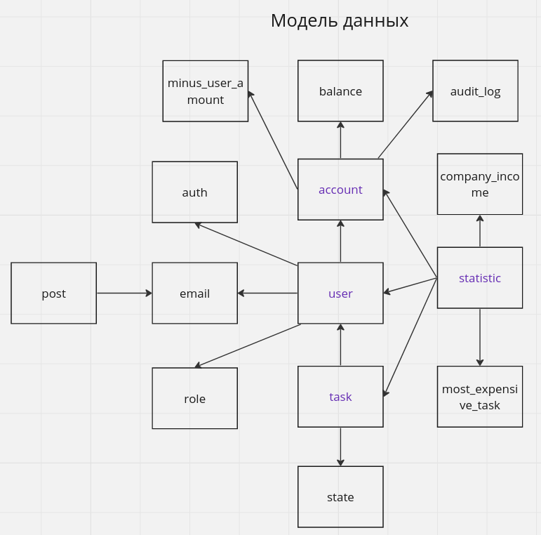
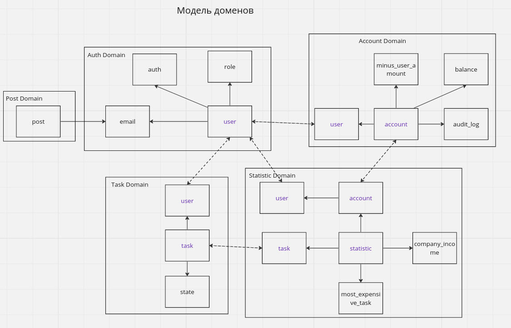
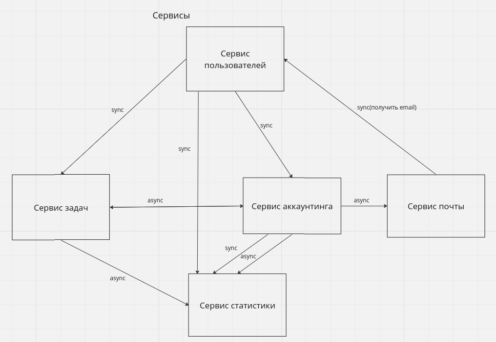
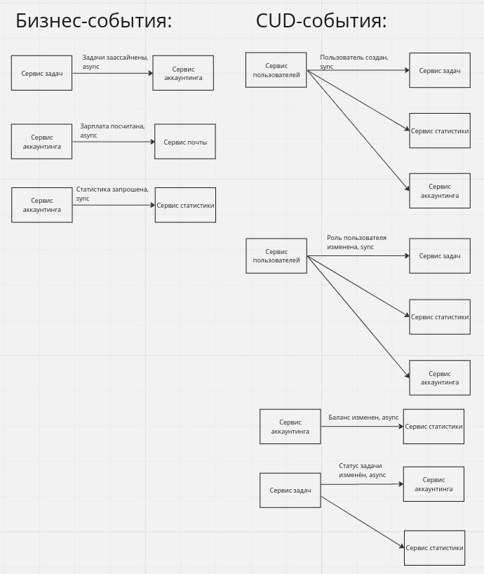

# Homework 1

## Задача: спроектировать систему

Полное решение: https://miro.com/app/board/uXjVMyf29bg=/?share_link_id=67256417532

ES-диаграмма:

Модель данных:

Модель доменов:

Сервисы:

События:

Не уверена насчет синхронности событий, связанных с пользователями.
